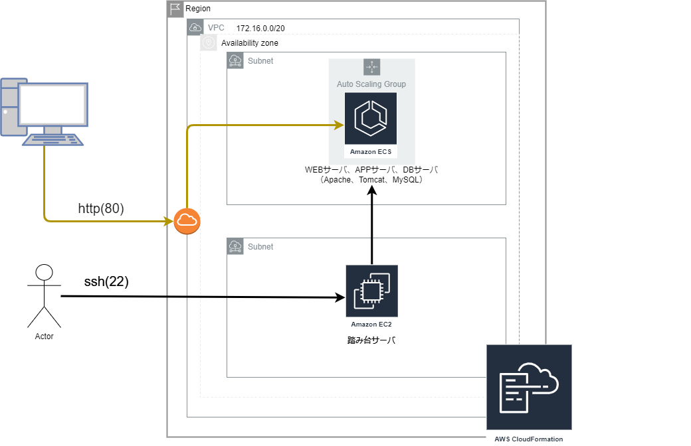
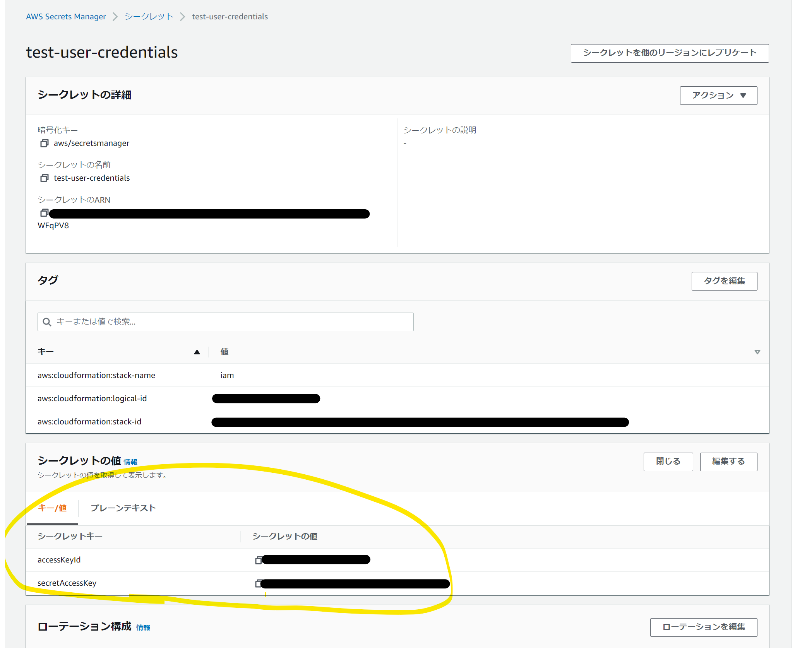

my-book-site
====

## Overview
書籍の登録や検索、編集ができるサイト

## Description
ー

## Demo
ー

## Requirement
- PG言語<br>

|            | バージョン   | ライブラリ   | フレームワーク    |
|:-----------|:------------:|:------------:|:------------:     |
| HTML       | ー           | ー           | ー                |
| CSS        | ー           | ー           | ー                |
| JavaScript | ー           | JQuery 3.6.0 | Vue 2.6.14        |
| Java       | 1.8           | ー           | Spring Boot 2.7.0 |

- DB<br>
MySQL 8.0.29

- その他<br>
Docker 20.10.11<br>
Apache<br>
Tomcat<br>

## Usage
### ■gradleビルド方法<br>
./app配下で以下を実行
```
gradel build
```
### ■dockerについて<br>
ローカル用のdocker-composeと、ECRプッシュ用のdocker-composeをそれぞれ用意している。<br>
それぞれ、apache, tomcat, mysqlコンテナの情報を記載している。<br>
ローカル、ECRプッシュ方法は以下に記載する通り。<br><br>
- docker起動方法（ローカル）<br>
./app配下で以下を実行
```
docker-compose -f docker-compose_dev.yml up -d
```
上記によりコンテナが起動したら、ブラウザから`localhost:80`でサイトにアクセスできる。<br>

- dockerイメージのプッシュ方法<br>
`docker-compose_pro.yml`の`image`の設定値を修正後（※）、以下を実行。
```
docker-compose -f docker-compose_pro.yml build
docker-compose -f docker-compose_pro.yml push
```
※プッシュするECRのリポジトリを指定する。<br>
ECRの作成に関しては、後述の「AWSへのデプロイ」を参照。<br>

### ■AWSへのデプロイ<br>
以下手順により、AWSにアプリをデプロイすることができる。（前提：AWSアカウントがあること）<br>
○AWSの構成図


○手順
1. IAMユーザの作成<br>
cloudfomationより、`01_IAM.yml`を使用しスタックを作成する。
2. ECRの作成<br>
cloudfomationより、`02_ECR.yml`を使用しスタックを作成する。
3. ECRにdockerイメージをプッシュ<br>
```
3-1. コマンドプロンプトで./app配下で以下を実行
aws configure

3-2. 「AWS Access Key ID」「AWS Secret Access Key」を聞かれるので、AWSマネジメントコンソールで「AWS Secrets Manager」へ遷移し、「test-user-credentials」の「シークレットの値」を入力する。（以下画像参照）
「Default region name」「Default output format」はそのままエンターでいいはず。

3-3. 上述の「dockerイメージのプッシュ方法」を実施
```


4. ECS等の作成<br>
cloudfomationより、`03_web_3layer.yml`を使用しスタックを作成する。

5. 4で作成したECSのEC2インスタンスのパブリックIPにアクセス<br>
これでWEBサイトが表示されたら成功！


## Install
ー
## Contribution
ー

## Author
ojarumaru1212